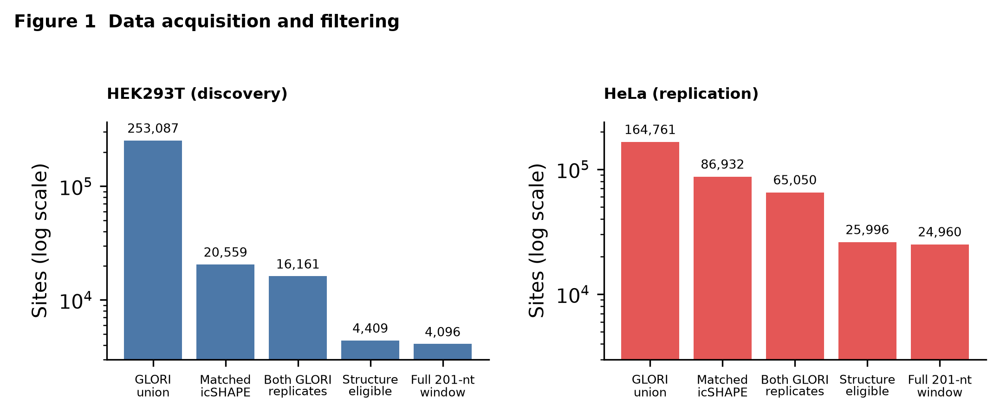
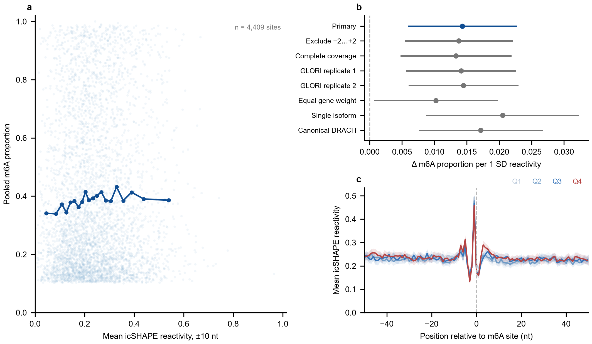
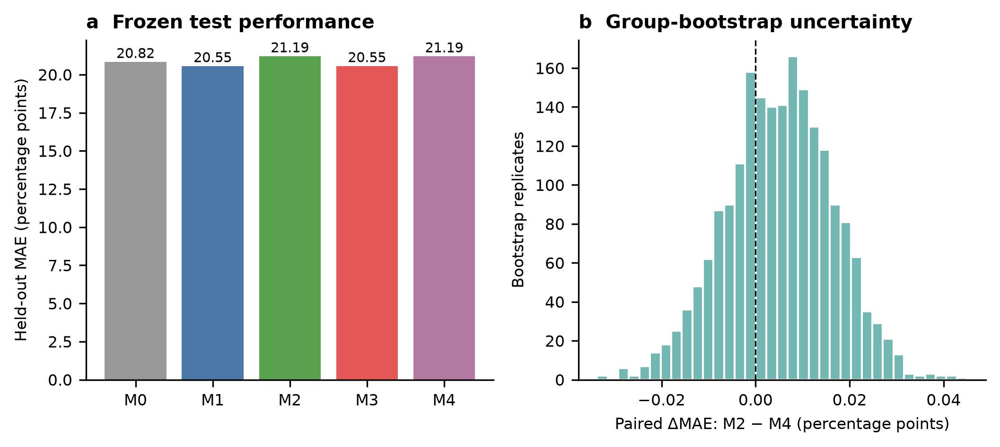
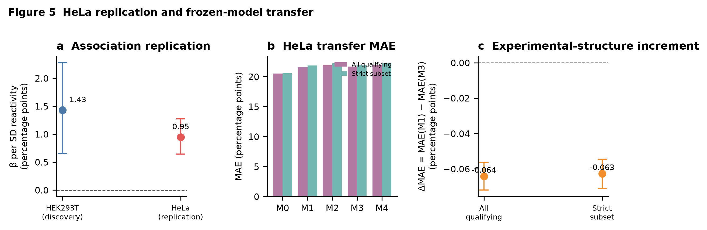

# RNAmodStruct (ModStruct)

> A reproducible computational framework for studying relationships between RNA modification levels and local RNA structure.



## Overview

RNAmodStruct investigates a central question: **Are RNA modification levels consistently associated with local RNA structure, and does structural information provide additional predictive value?**

The main analysis uses HEK293T as the discovery system and HeLa as an external replication system, integrating GLORI-based m6A quantification, experimental icSHAPE reactivity, and ViennaRNA-predicted structure. Later phases assess conditional dependence, cross-technology consistency, additional RNA modifications, and directional evidence from perturbation data.

The project is designed around several principles:

- Freeze inputs, thresholds, and outputs in stage-specific YAML configurations.
- Keep discovery, external replication, sensitivity analysis, and post hoc exploration distinct.
- Group observations by genes and identical sequences to reduce information leakage.
- Preserve both positive and negative results.
- Track provenance and reproducibility with SHA-256 manifests, machine-readable status files, and automated tests.
- Distinguish association, directionality, causality, and mechanism explicitly.

## Project status

| Component | Status |
|---|---|
| Core HEK293T analysis and HeLa replication | Complete |
| Phase 1 methodological extensions (stages 12–17) | `REPRODUCIBLE` |
| Phase 2 condition and cross-technology validation (stages 18–22) | `PASS` |
| Phase 3 multi-modification extension (stages 23–27) | `COMPLETE` |
| Phase 4 perturbation directionality analysis (stages 28–31) | `COMPLETE_DIRECTIONALITY_ONLY` |
| Automated test suite | 87 tests passed |
| Main release manifest | 308 files verified by SHA-256 |

Machine-readable status records are stored in [`results/status/`](results/status/), and stage reports are stored in [`results/reports/`](results/reports/).

## Main findings

1. **m6A level shows a small, directionally consistent association with local RNA structure.** Effects have the same direction in HEK293T and HeLa. The fixed-effect estimate across the two cell lines is beta/SD = 0.01007 (95% CI 0.00713–0.01301).
2. **Experimental structure does not provide stable additional predictive value in external validation.** Wider structure windows, conditional-dependence analyses, and nonlinear models do not elevate the observed association into robust mechanistic evidence.
3. **The multi-modification extension does not identify a clear association.** Under the available public data, technology-specific models, and coverage thresholds, the primary HeLa analyses for m5C, m7G, and Nm do not pass FDR 0.05. This does not demonstrate that the true effects are exactly zero.
4. **METTL3-inhibition data support a directional description, not a causal claim.** GSE264642 contains 24,898 paired transcripts with a systematic structural shift. Without matched site-level m6A measurements, rescue or inactive-compound controls, and independent replication, the highest supported evidence level remains `Directionality`.

Detailed results and limitations are available in:

- [Phase 1 methodological extension summary](results/reports/phase1_summary_report.md)
- [Phase 2 completion and exit-gate report](results/reports/22_phase2_completion_report.md)
- [Phase 3 multi-modification report](results/reports/27_phase3_completion_report.md)
- [Phase 4 directionality report](results/reports/31_phase4_completion_report.md)
- [Conference paper outline](docs/reports/final/ModStruct_conference_paper_outline.md)

## Analysis roadmap

| Stage group | Script numbers | Purpose |
|---|---:|---|
| Input and coordinate audit | 02–04 | Download reference assets, verify versions and coordinate systems, and audit input integrity |
| HEK293T primary analysis | 05–08b | Build the analysis dataset, estimate associations, run predictive ablations, and diagnose structure features |
| HeLa external replication | 09–10 | Build an independent dataset, compute structure, re-estimate effects, and transfer frozen models |
| Release integrity | 11 | Generate or verify the main release manifest |
| Phase 1 | 12–17 | Meta-analysis, conditional dependence, entropy, isoform and window sensitivity, and nonlinear models |
| Phase 2 | 18–22 | Public-data audit, in vivo/in vitro pairing, cross-technology validation, and admission gates |
| Phase 3 | 23–27 | Source scouting, file auditing, and stratified analyses for m5C, m7G, Nm, and other modifications |
| Phase 4 | 28–31 | Perturbation-source audit, paired directionality analysis, evidence grading, and model gates |

Each executable stage reads a corresponding `config/<stage>_*.yaml` file that freezes inputs, thresholds, and output locations. Stage numbers form the stable interface of the pipeline. See the [file naming convention](docs/FILE_NAMING_CONVENTION.md) for details.

## Repository layout

```text
RNAmodStruct/
|-- config/                     # Frozen YAML configuration for each stage
|-- data/
|   |-- raw_processed/          # Immutable downloads; ignored by Git and tracked by manifests
|   |-- reference/              # Genome, transcriptome, and annotation assets; ignored by Git
|   |-- interim/                # Reproducible intermediate datasets; ignored by Git
|   `-- final/                  # Analysis-ready datasets; ignored by Git
|-- docs/
|   |-- reports/final/          # Final report, defense material, and paper outline
|   |-- reports/progress/       # Progress reports
|   `-- research_notes/         # Research plans and workflow notes
|-- metadata/
|   |-- audits/                 # Input, reference, and coordinate audits
|   |-- decisions/              # Frozen decisions and preregistered boundaries
|   |-- manifests/              # Download, source, and release manifests
|   |-- provenance/             # Field semantics, environment, and source verification
|   `-- software/GLORI-tools/   # Pinned upstream tool submodule
|-- results/
|   |-- figures/                # Publication figures and visual QA artifacts
|   |-- reports/                # Stage-level technical reports
|   |-- status/                 # Machine-readable run and completion status
|   |-- tables/                 # Summary statistics and model-evaluation tables
|   |-- models/                 # Reproducible model artifacts; ignored by Git
|   `-- logs/                   # Runtime logs; ignored by Git
|-- src/                        # Analysis scripts and shared modules
|-- tests/                      # Stage tests and release-integrity tests
|-- environment.yml            # Conda environment specification
`-- README.md
```

## Environment setup

Create the pinned Conda environment:

```bash
conda env create -f environment.yml
conda activate rnamodstruct
```

The environment uses Python 3.13.15. Major dependencies include NumPy, pandas, SciPy, scikit-learn, statsmodels, PyYAML, Matplotlib, Biopython, PyArrow, and ViennaRNA 2.7.2. The complete environment audit is available in [`metadata/provenance/environment.txt`](metadata/provenance/environment.txt).

No GPU is required. Approximately 16 GB of RAM is recommended for the full workflow.

On the development machine, the configured interpreter can be used directly:

```powershell
E:\ancd\envs\my_pytorch\python.exe -m pytest tests -q
```

## Data preparation

Large raw datasets, reference assets, intermediate datasets, final datasets, and model artifacts are not committed to Git. Their identities and expected locations are recorded in manifests:

- [`metadata/manifests/source/source_manifest.csv`](metadata/manifests/source/source_manifest.csv) — primary data sources, experimental conditions, and local paths.
- [`metadata/manifests/download/download_checksums.csv`](metadata/manifests/download/download_checksums.csv) — checksums for immutable downloads.
- [`metadata/manifests/source/02_reference_manifest.csv`](metadata/manifests/source/02_reference_manifest.csv) — reference genome, transcriptome, and annotation versions.
- [`metadata/manifests/download/phase3_download_manifest.csv`](metadata/manifests/download/phase3_download_manifest.csv) — download records for the multi-modification extension.

Reference assets can be prepared with:

```bash
python src/02_download_reference_assets.py
```

The HeLa icSHAPE archive `GSE145805_RAW.tar` is read in place. The pipeline accesses the member `GSM4333258_HeLa.out.txt.gz` directly, so manual extraction is unnecessary.

## Running and validating the project

Run the primary pipeline in stage-number order. Each script reads its stage-specific YAML configuration and writes outputs to the appropriate `data/`, `metadata/`, or `results/` subdirectory.

Run the minimum validation workflow from the repository root:

```bash
python -m pytest tests -q
python src/11_verify_release.py --verify
```

Regenerate and verify the main release manifest when intentionally freezing a new release state:

```bash
python src/11_verify_release.py --write-manifest
python src/11_verify_release.py --verify
```

The main manifest is stored at [`metadata/manifests/release/release_manifest.csv`](metadata/manifests/release/release_manifest.csv). Phases 1–4 also have independent manifests so that each evidence layer can be verified without mixing its frozen scope with other phases.

## Key analytical conventions

- Response variable: coverage-weighted `combined_ratio = (Acov1 + Acov2) / (AGcov1 + AGcov2)`.
- Primary structure metric: `R_flank10`, the mean valid reactivity across positions -10..-1 and +1..+10, with at least 70% valid coverage on each side.
- Data splitting: connected components formed from `analysis_gene` and identical 201-nt sequences, frozen into an 80/20 development/test split.
- Primary predictive comparison: delta MAE = MAE(M2) - MAE(M4) in HEK293T; external transfer comparison: MAE(M1) - MAE(M3) in HeLa.
- Ridge alpha grids must bracket the selected optimum. A stage fails instead of freezing a boundary optimum.
- Observational associations, predictive importance, and perturbation directionality must not be interpreted automatically as causal mechanisms.

Frozen decisions and deviations are documented in:

- [`metadata/decisions/08_prediction_modeling_decision_log.md`](metadata/decisions/08_prediction_modeling_decision_log.md)
- [`metadata/decisions/09_hela_replication_decision_log.md`](metadata/decisions/09_hela_replication_decision_log.md)
- [`metadata/decisions/phase4_preregistration.md`](metadata/decisions/phase4_preregistration.md)

## Figure preview

| HEK293T association | Predictive ablation | HeLa replication and transfer |
|---|---|---|
|  |  |  |

Vector and publication-ready versions are available in [`results/figures/`](results/figures/).

## Evidence boundaries

The current repository supports small-effect associations, external replication, cross-technology sensitivity analyses, and aggregate directional changes following perturbation. It does **not** support the following claims:

- A change in RNA modification has been proven to cause a structure change at a specific site.
- Predictive feature importance is equivalent to a biological mechanism.
- A non-significant result proves that the true effect is zero.
- Measurements from different cell lines, technologies, or studies can be pooled without respecting their original scales.

Future matched site-level modification measurements, rescue or inactive-compound controls, and independent replication should be treated as a new confirmatory phase rather than written back into the current exploratory analyses.
