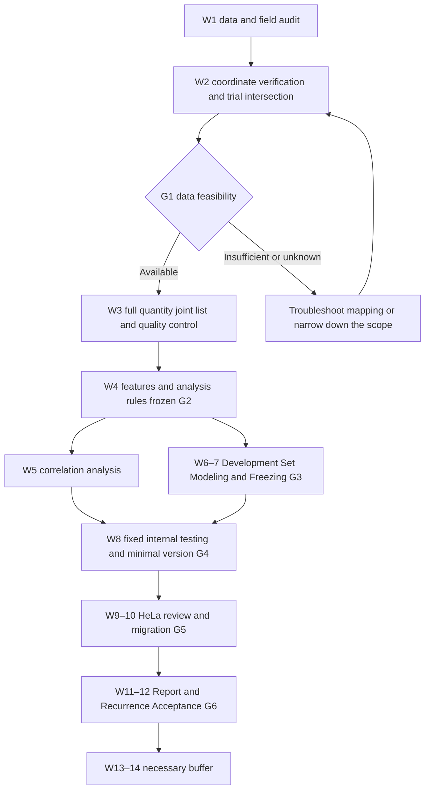

# ModStruct complete execution roadmap

> Basis: "ModStruct_Undergraduate Research Plan.md". Date of preparation: 2026-09-10. Goal: Transform existing research designs into executable, checkable, and reproducible research tasks.
>
> Currently, only research plans, popular interpretations and early discussions have been found in the project directory, but no data files or analysis codes have been found. The following is a schedule of future work and does not mean that data audits, environmental inspections or experimental verifications have been completed. This roadmap follows the data candidates and methods of the local plan, and does not add new literature verification conclusions; the true status of the data will be subject to the audit in weeks 1-2.

## Document information (Material Passport)

- Origin Skill: academic-research-suite / experiment-agent
- Origin Mode: plan
- Origin Date: 2026-09-10
- Verification Status: UNVERIFIED (research execution and data content have not yet been verified)
- Version Label: roadmap_v1
- Plan basis: "ModStruct_Undergraduate Research Plan.md" in the same directory, the formal plan takes precedence over popular interpretation and early discussions.
- The file names, task splitting and management rules added in this article are implementation suggestions and are not existing project assets.

## 1. Complete goals and scope

**Using public GLORI and icSHAPE data, build a credible site-level joint table to answer the association of m6A modification proportions with local experimental structure signals, and quantify the additional predictive value of experimental structures with a fixed test set. **

| Research Questions | Implementation Objectives | Evidence of Completion |
|---|---|---|
| Q1: Is modification ratio related to neighborhood reactivity? | HEK293T description, covariate adjustment, gene clustering uncertainty estimates | Effect table, 95% CI, local curves, sensitivity analysis |
| Q2: Can the experimental structure improve predictions? | Compare sequences, predicted structures, and experimental structures under the same sample and partition | Fixed test set MAE, paired ΔMAE and interval |
| Q3: Can I review it after changing the data set? | HeLa association review and frozen model migration | Review effects, performance of all eligible sites and strict subsets |
| Q4: Can you distinguish between retouched and low-retouch backgrounds? | Only considered after obtaining qualified measurable background | Background detection capabilities, matching records, independent test results |

Mainline-limited human mRNA, m6A, HEK293T discovery set and HeLa review set. Q4 and other extensions do not affect mainline acceptance. Conclusion does not require significance, forward prediction gain, or publication; zero gain and review failure should also be delivered truthfully.

## 2. Cycle, investment and critical pathAccording to the plan, **12 weeks of main line + 2 weeks of buffer** are adopted, with students taking about 12-15 hours per week and tutors taking about 30 minutes per week. 12 weeks corresponds to approximately 144-180 hours of student input, plus buffer. Week 1 begins with the actual launch day, and it is not assumed that data analysis has been launched today.

The critical path is as follows; if the previous level is not passed, subsequent statistical results cannot become formal evidence:



HeLa's file accessibility and format pre-checking should be started in advance in W1-2; formal association and migration analysis should be placed after the main rule freeze. Literature comparison, data dictionary, and method writing are maintained simultaneously at each stage.

## 3. Weekly tasks and acceptance

| Weekly | Core Work | Must Deliver | Acceptance Criteria and Dependencies |
|---|---|---|---|
| W1 | Read the data method; record the source; download the processed file of the discovery set; check the environment; pre-check HeLa | Literature comparison table, source list, field samples, environment records | Can explain the sample conditions, data units and unknown fields of each input; unknown items have processing tasks |
| W2 | Confirm the reference and annotated version; small-scale mapping; check link directions and windows; trial calculation of intersection | Coordinate audit, at least 20 site verification, preliminary screening table, G1 decision | Coordinates and quantitative meanings are clear; the number of intersections is actual calculation; data sample and gene number selection range |
| W3 | Full resolution and mapping; repeat integration; mRNA/isoform filtering; coverage and deletion QC | Union table v1, data dictionary, full filter count, repeat QC | Core biological unit unique; deletions not zeroed; all exclusions traceable |
| W4 | Generate sequence and experimental structure features; design predicted structure calculations; establish groupings; freeze configurations | Feature dictionary, partition table, configuration v1, Figure 1-2 first version, G2 record | Primary endpoint, threshold, grouping, search range clear; test set storage |
| W5 | Primary correlation model; gene clustering bootstrap; sensitivity analysis required | Effect scale, model diagnostics, Figure 3 | Report effects, CIs, sites and gene numbers; main analysis and exploratory analysis separate |
| W6 | 201 nt predicted structure; development set M0—M4 Ridge; check preprocessing | Predicted structure cache, development set comparison table, training pipeline | All fittings only use training folds; model comparisons use common site sets || W7 | Run lightweight tree model when data volume allows; complete ablation; fixed model | Model files, parameters, feature order, development set results, G3 records | Limited parameter search completed; test results are not used for model selection; internal early stopping does not cross groups |
| W8 | One-time internal testing; paired bootstrap; sorted single cell line delivery | Figure 4, site-by-site prediction, minimum version report, runnable code, G4 record | Q1+Q2 minimum version complete; if only M3 vs. M1, clarify the scope of evidence |
| W9 | HeLa full analysis, same rule QC, independent correlation estimation | HeLa joint table, process table, review effect table | D/N is not regarded as a duplicate; condition differences are recorded; rules are not modified according to the results |
| W10 | Direct migration of frozen model; strict subset evaluation; choose an extension if you have enough energy | Figure 5, migration results, failure cause analysis, G5 record | HeLa label does not adjust parameters; reduce generalization expression when strict subset is insufficient |
| W11 | Integrate results, methods, literature differences, failure cases and limitations | First draft of the report, 5 main figures and legends, supplementary tables, defense outline | Each conclusion can be traced to a table or figure; do not miss zero gain or unstable results |
| W12 | Rerun critical analysis from fixed intermediate table; verify code, values ​​and sources | Final delivery package, recurrence record, mentor verification record, G6 record | Independent run instructions are valid; major values ​​are reproducible; all unfinished items are explicitly marked |
| W13—14 | Incorporate download, annotation mapping, software environment, or report revision delays | Gap closure records or explicit downgrade delivery | No buffer periods for infinite model addition or pursuit of significance |

## 4. Phase A: Data Audit and Feasibility (W1-2)

### 4.1 Input list

The following are all candidates specified in the original plan, and the actual document content must be confirmed after audit.

| Purpose | Candidate input | Issues that must be implemented |
|---|---|---|
| HEK293T Experimental Structure | InVivo BaseReactivities for GSE74353 | Transcript version, coordinate origin, missing encoding, reactivity definition |
| HEK293T m6A | GSE210563: GSM6432590, GSM6432591 | Modification ratio field, author filtering rules, coverage field, duplicate correspondence |
| HeLa experimental structure | Post-processing reactivity of GSE145805 | Required documents, structure processing flow, D/N meaning; not merged as biological duplicates |
| HeLa m6A | GSM6432595, GSM6432596, hypoxia- control | Differences between normoxic control conditions and another study, field consistency |
| References and Annotations | Sequence and transcript annotations corresponding to original structural studies; GLORI corresponding references | Version origin, strand direction, splicing structure and cross-version conversion feasibility |A read-only copy of the original file is retained after processing. The source list records accession, file name, source URL, download time, SHA-256, sample conditions, technology, reference version and field description basis on a file-by-file basis. For unknown items, write "to be confirmed" and do not rely on the file name to infer.

### 4.2 Coordinate verification sequence

1. Confirm the biological meaning of each line, the starting method of coordinates, and the opening and closing of intervals.
2. Actual transcript annotation by structural data, mapping transcript positions to linked genomic coordinates.
3. Link to the GLORI site and perform documented reference version migrations if necessary.
4. Verify that the center of the transcript direction is A and check the neighboring sequences; the negative-strand genome reference can be T.
5. Extract the 201 nt sequence according to the spliced transcript to avoid directly intercepting the genome window across introns.
6. Manually check at least 20 sites, covering positive and negative strands, splicing boundaries, and multi-isomer situations; save input lines, mapping paths, expected values, program values, and conclusions.
7. Make automatic assertions on the central base, length, link direction, boundary and mapping uniqueness, and enter exceptions into the exclusion list.

### 4.3 G1: Continue, zoom out or pause

| Audit results | Decision-making |
|---|---|
| Approximately ≥2,000 sites and approximately ≥300 genes, with reasonable quality and distribution | Advancing the complete main line |
| About 500-2,000 sites, or fewer independent genes | Prioritize low-dimensional association and Ridge; reduce features, tree model is reduced to selection |
| Less than about 500 sites, or the key layer lacks independent genes | Check the version, link direction, window and coverage first; evaluate the candidate alternative data of the original plan if necessary |
| Coordinates or modified quantitative fields cannot be determined | Suspend formal statistics of this data; record blocking evidence and pending issues |
| Lack of detectable low-modification background | Cancel Q4 and continue the continuous scale mainline |

These are engineering thresholds for the original plan, not guarantees of statistical efficacy. Substitute data needs to go through the same audit process again, and the main set cannot be replaced because a certain combination is more effective.

## 5. Phase B: Union tables, features and analysis freeze (W3-4)

### 5.1 Union table

Taking "genomic site + chain + cellular conditions" as the core unit. The original replicate measurements and source mappings are retained; summary tables used for formal analysis must not treat multiple isomers at the same site as independent samples. The mainline maintains unambiguous records of local sequences and region ownership.The union table contains at least: site/gene/transcript identification, reference and condition, repeat proportion and summary proportion, available valid count and confidence index, 201 nt sequence, motif, region, GC, stop codon and splice boundary distance, experimental reactivity and deletion mask, window coverage, predicted structure, reason inclusion and split_id. Unobtainable expressions or depths preserve missing descriptions without forging replacement fields.

The screening table reports both the number of sites and the number of genes for each step: original record → deduplication → sequence verification → mRNA annotation → isoform processing → repeat QC → structural coverage → final analysis set. The number of records, the number of unique sites and the number of genes are counted separately; sequential elimination gives the mutually exclusive main reasons and saves all failure marks.

### 5.2 Frozen features and QC

- Response: Integration of m6A ratios by mass-required replicates. When there are only proportions, the repeated mean is used; when there are comparable valid counts, the original process is used to evaluate whether the counts can be combined.
- Main structure indicator: R_flank10, that is, the effective reactivity average of -10...-1 and +1...+10; at least 70% effective value on the left and right.
- Additional structures: R_up20, R_down20, R_far; R_0 only additional analysis. Minimum coverage requirements for additional windows should also be written into the configuration after the audit.
- Sequence: Fixed 201 nt one-hot and default 3-mer; when the boundary causes the window to be insufficient, it will be excluded or single-column according to predetermined rules and will not be temporarily filled.
- Predicted structure: unpaired probability, MFE/nt, paired state entropy of the same 201 nt; saves software version, parameters, temperature and sequence hash. Probabilities are derived from partition function calculations.
- Depth: Compare the retention rates of ≥10, ≥20, and ≥50 only when the effective depth field is clear, and then determine the main threshold; the threshold is not selected based on the formal association results.
- Missing: converted according to the original file definition, NULL or -999 does not become zero; distinguish between actual measurement and AI padding signals.

### 5.3 G2: Statistical rules and data division are frozen at the same time

About 80% of the genes of HEK293T enter the development set and 20% enter the internal test set; the development set uses 50% off GroupKFold, and when the genes are insufficient, it is changed to 30% off in advance. The same sites are repeated and the same gene sites remain in the same group. 201 nt sequences that are completely repeated across genes must be grouped together or deduplicated according to fixed rules; if multiple genes are connected, a joint grouping must be formed based on the relationship between the gene and the repeated sequence. Audit highly similar sequences and account for unresolved homology risks.The configuration freeze includes at least: sample and reference versions, inclusion rules, missing encodings, windows, thresholds, responses, covariates, primary indicators, bootstrap times, random seeds, grouping methods, parameter candidates, main model comparisons, exploratory test families, and representative site selection rules.

To protect the test set, only the development set is used in the development phase for determining grouping thresholds, features, descriptive graphs of transformations, and correlation exploration. Pure measurement QC of the full discovery set can be used for auditing, but cannot pick features based on test label relationships. The final Q1 can be estimated at the complete discovery set grid site according to the frozen scheme; the analysis population needs to be explicit and the final association results need to be avoided to be fed back to the prediction model. W8 outputs formal charts when summarizing.

Errors after freezing should still be corrected: record reasons, impact data, configuration version and rerun scope. If the correction occurs after seeing the test results, report the original results and correction process, and do not continue to describe the repeatedly viewed test set as a completely untouched validation set.

## 6. Phase C: Association Analysis (W5)

The master model uses sequential modification ratios as responses, with R_flank10 as the sole primary structural metric, adjusting for DRACH isoforms, transcript regions, local GC, distance from stop codons, and available expression/coverage information. Clarify general DRACH limits and their applicable populations.

The main table reports raw scaling coefficients, modification proportion change corresponding to one standard deviation change in structural signal, 95% CI, number of sites, and number of genes. Gene clustering bootstrap is recommended 1,000 times, compared to clustering robust standard errors; check residuals and apparent nonlinearity. Nonlinear sensitivity methods and degrees of freedom are fixed in advance.

The following sensitivity analysis must be completed:

| Analysis | Problems to Troubleshoot |
|---|---|
| Exclusion of center 0 and further exclusion of -2…+2 | Whether correlation is highly dependent on modified neighbor detection signal |
| Higher structure coverage subsets | Do missingness and measurement quality drive correlations |
| GLORI calculated separately for two replicates | Whether the correlation depends on a certain measurement |
| Equal weight for each gene | Whether a few multi-locus genes are dominant |
| Strictly free isomer ambiguity set | Whether mapping and regional assignment affect the conclusion |
| CDS/3′UTR stratification when sample allows | Whether different regions exhibit different effects |

If the main set is completely free of isomer ambiguity, it should be stated that this restriction has been implemented, and whether a more rigorously identifiable subset can still be defined should be reported; do not repeat the same analysis pretending to be additional robustness evidence.Exploration window, region and position-by-position tests respectively define test families and do BH-FDR. Local curves report valid quantities on a position-by-position basis; point-by-point CIs are not written as simultaneous confidence bands for the entire curve.

## 7. Phase D: Model ablation and minimal version (W6-8)

### 7.1 Model matrix

Let C be the common background covariate, X be the 201 nt sequence, P be the calculated structure in the same window, and R be the experimental structure.

| Number | Input | Explanation |
|---|---|---|
| M0 | C | Background baseline |
| M1 | C＋X | Sequence Baseline |
| M2 | C＋X＋P | Calculate the gain of structural representation |
| M3 | C＋X＋R | Gain of experimental structure relative to sequence |
| M4 | C＋X＋P＋R | Gain of experimental structure relative sequence and calculated structure |

Complete Ridge first; compare a small amount of alpha=0.1, 1, 10, 100 according to the plan. The HistGradientBoostingRegressor can be supplemented when the amount of data allows, with about 6-8 groups of candidates; disable random internal early stopping, or use a verification method that clearly does not cross groups. Each learner uses the same sample, partition, response and evaluation methods internally.

All interpolation, scaling, feature selection, and parameter selection are performed within the training fold. If the model needs to predict and crop to [0,1], it must be fixed in advance and used uniformly for similar comparisons, and it cannot be selected after testing. Covariates or coverage can produce predictive gain that is not equivalent to biological structural mechanisms.

### 7.2 G3: Freeze before testing

Save the model, preprocessing, feature order, training data hash, parameters, random seeds, and dev set results. It is recommended that Ridge's M4 versus M2 be preset as the main model family comparison, with the tree model as a supplement; if other main model selection rules are used, they must be written in G2 and executed only based on the development set. The main conclusions cannot be selected based on internal test results.

### 7.3 W8 one-time test

Primary indicator: ΔMAE = MAE(M2) − MAE(M4), positive value is error reduction; secondary indicators are Spearman, RMSE and R². If MAE is multiplied by 100 from the 0-1 ratio, the unit is percentage points and cannot be written as classification accuracy.

Pairwise ΔMAE intervals were calculated using the same batch for all models using test genes or actual joint groups as resampling units. If cross-gene sequence relationships form a larger group, this independent grouping shall prevail. The interval reflects the test sample uncertainty of the fixed model and does not cover the entire batch and training uncertainty.

### 7.4 G4: Minimum version delivered

- Trusted HEK293T joint data, complete screening tables and coordinate verification.
- Q1 Main correlation, interval, necessary sensitivity analysis and limitation description.
- Fixed test set sequence comparison with experimental structure, site-by-site prediction and group audit.
- Figure 1-4, single cell line report, runnable script and configuration.- If the predicted structure is not completed, M3 versus M1 can be used to deliver a minimal version, but it is clear that M4 versus M2 is not yet complete; this version cannot claim to have separated the contributions of the computational structure and the experimental structure.

## 8. Phase E: HeLa review and optional extensions (W9-10)

HeLa uses the same logic to re-audit and build tables to record different years, processing procedures and culture conditions. The thresholds and rules of the discovery phase are applied directly, and the reasons are recorded in case of failure; the technical processing that must be adjusted is used as a version deviation description, and the rules are not adjusted according to the direction of the effect.

**Correlation Review:** Reestimate frozen defined correlation coefficients in HeLa, reporting direction, magnitude, interval, number of sites, and number of genes. Refitting the correlation model here is an independent review, which does not mean allowing HeLa to be used to adjust the HEK293T prediction model.

**Predicted Migration:** Freezing the HEK293T model and preprocessing to directly predict HeLa report all qualified sites and a strict subset after removing genes/repetitive sequences that have occurred during development, respectively. Record all training and parameter tuning data actually used by the final model, and use these records to determine the exclusion range. After W8, the internal test set is not included by default to retrain the migration model.

| G5 Results | Delivery Method |
|---|---|
| Sufficient qualified data | Complete association, migration and strict subset comparison to form Figure 5 |
| Few strict subsets | Report numbers and wide intervals, limited to cross-cell background migration |
| Opposite effects or model migration failure | Report failures to check for coverage, range, and batch differences that are not solely attributable to cell specificity |
| The data is always unavailable or cannot be confirmed quantitatively | Deliver the minimum version + evidence of obstruction; it is clear that the original HeLa full version requirements are not met |

Choose an extension only after mainline completion: 401 nt window sensitivity (simultaneous extended sequence baseline), in vitro comparison, SAC-seq cross-technology review, or classification/log loss gain when there is a qualifying background. High-dimensional conditional mutual information estimation does not enter the main line of undergraduate courses.

## 9. Engineering organization and reproducible delivery

The following is the directory structure to be implemented; this article only establishes a roadmap and does not create analysis code or data.

```text
RNAmodStruct/
  README.md #Running sequence, input requirements, expected output
  config/analysis.yaml # Freeze analysis configuration
  metadata/manifests/source/source_manifest.csv # Source, condition, hash
  metadata/provenance/data_dictionary.md # Original fields correspond to standard fields
  metadata/decisions/ # Decision, freeze and deviation records
  metadata/audits/coordinate/04_hek293t_coordinate_checks.csv # Manual verification and automatic assertion summary
  metadata/provenance/environment.txt # Python, software and package versionsdata/raw_processed/ #Download file after original processing
  data/reference/ # Traceable references and transcript annotations
  data/interim/ # Normalization, mapping and folding cache
  data/final/ # HEK293T/HeLa joint table
  results/tables/08_hek293t_group_assignments.csv # Locus, gene, combination group, hyphen
  src/03_audit_inputs.py
  src/04_validate_coordinate_mapping.py
  src/03_build_features.py
  src/04_association.py
  src/05_models.py
  src/06_validate.py
  tests/ # Coordinates, feature formulas, grouping and leak checks
  results/tables/
  results/figures/
  results/models/

  results/logs/
  docs/reports/final/
```

Use known Python paths `E:\ancd\envs\my_pytorch\python.exe`, check actual package versions and availability first; the roadmap does not assume that required packages are installed. Do not modify existing PyTorch core dependencies. If ViennaRNA needs additional environment, it can be processed independently; if the environment is prepared for more than half a day, the main line of sequence and experimental structure should be advanced first.

According to the plan, 16 GB of memory and 10-20 GB of project space are tentatively budgeted. This will be revised after W1 actually measures the machine and input scale. Mainline does not require a GPU. Existing LibreOffice can be used for subsequent document export, and the official format is determined by delivery requirements.

Each script needs to record the input/configuration hash, version, start and end time, number of records, output path and error summary. First do a small batch trial run to estimate the time, memory and disk, and then determine the timeout of the full task; long tasks are placed on stage or in batches. If the operation fails, keep the log and try again after locating the cause. It is forbidden to silently ignore bad lines.

Required tests focus on high-risk logic: positive and negative strand/exon boundary mapping, window length versus central A, missingness mask, reactivity mean, probability/entropy formula, replicate integration, grouping mutual exclusion, preprocessing-only training fold fit, and inter-model sample consistency.

## 10. Result package and acceptance level

| Results | Content | Acceptance Points |
|---|---|---|
| Figure 1 | Data source, conditions, filtering process and quantity | Consistent with source and filtering table |
| Figure 2 | Repeat consistency, coverage, and modification of grouped local curves | Grouping rules are frozen, and the effective number per position can be checked |
| Figure 3 | Adjusted effect and sensitivity forest plot | Effect direction, unit, CI are consistent with the result table |
| Figure 4 | M0—M4 MAE and paired ΔMAE | The same test sample; the main comparison is clear in advance |
| Figure 5 | HeLa review, migration, representative sites | Strict subsets in single column; display at least one failure case |
| Report | Questions, data, methods, results, discussion, limitations, sources | Each result can be traced; correlation is not written as cause and effect |
| Reproduction package | Configuration, partitioning, dictionary, code, environment, operation instructions | Successfully rerun the main table chart from the fixed intermediate table |G6 Final verification: deterministic data conversion and division should be consistent; random analysis is reproduced under fixed seeds and recording environments. If there are numerical differences, they should be explained and recorded according to the numerical accuracy specified in advance. It cannot be regarded as a complete reproduction just because the conclusion direction is consistent. Also retained are the steps and necessary reference files for reconstructing the intermediate table from the original processed files.

Reports must be clear: the study targets are sites that have been called and passed QC; icSHAPE reactivity is not a direct pairing probability; calculated structural improvements are characterization gains; adjustments only cover listed covariates; cell line changes are entangled with study batches; there are practical boundaries for the treatment of isogenic and homologous sequence dependencies.

## 11. Risk and response priorities

| Risk Signals | Prioritization | Impact on Scope/Schedule |
|---|---|---|
| Central non-A, motif anomaly, extremely low intersection | Check starting point, link direction, reference and transcript version item by item | Block formal analysis, use buffer first |
| There are few effective sites or independent genes | Press G1 after screening to reduce the size of features and models | Keep supportable descriptions and low-dimensional analysis |
| Lacks depth or expression | Inherits informed author filtering, flags non-adjustable items | Does not claim adequate control over detection capabilities or expression |
| Structural deletion biases towards high expression | Compare inclusion/exclusion groups and high coverage sensitivity | Narrow the applicable population and do not treat interpolation as a solution to bias |
| Folding environment or calculation delay | Complete M1/M3 first, cache deduplication sequence folding | Keep the minimum version of W8; complete the full version M2/M4 |
| Test set leaks or post-test rules | Stop the conclusion of this version, audit the impact and explain | Do not cover up existing leaks with new random seeds |
| ΔMAE≤0, wide range or unstable direction | Report truthfully after verification process | Do not pursue positive values ​​by expanding search or replacement thresholds |
| HeLa is unavailable | W1-2 Pre-check in advance and evaluate the original plan alternatives | The full version is postponed or explicitly downgraded, and does not pretend to be completed Q3 |
| Workload exceeds budget | Press Q4/Expand → Tree Model → Optional diagram explanations are deleted in turn | Protect coordinate verification, main association, fixed testing and reproduction |

## 12. Division of responsibilities and weekly execution methodsStudents are responsible for actual data reading, script execution, source and decision recording, and being able to interpret each column and each figure; the instructor focuses on checking the meaning of G1 data, G2 research rules, G3 pre-test freezing, and G6 conclusion boundaries. AI can assist in coding, retrieval, and organization. It does not replace actual document verification or instructor judgment. Usage will be disclosed as required by the school.

A one-page progress record is formed every week: completed tasks and evidence paths, actual site/gene number changes, unresolved issues, configuration deviations, and up to three priority tasks for the next week. Disputes over unknown data semantics and key rules should be submitted for discussion in a timely manner; non-dispute engineering work continues to advance and will not be handled until weekly meetings.

## 13. The first five work blocks after startup

1. **Preparation (about 2 hours):** Create directory, source list and decision record; check Python, available memory and disk; list missing software, leave the core environment unchanged for now.
2. **Data location and field audit (about 3 hours):** Obtain the processed file of the discovery set and record the hash; explain the header, missing and unit column by column; pre-check whether the reactivity after HeLa processing is desirable.
3. **Reference traceback (approximately 3 hours):** Confirm the transcript sequence and annotated version of the structural data, GLORI reference and strand information, and list the reasons why direct connection cannot be made.
4. **Mapping test (about 3-4 hours):** Select positive and negative chains and boundary cases to establish a small-scale mapping that can be checked; unresolved version issues are brought to W2 first.
5. **Phase review (about 1-2 hours):** Output the draft field dictionary, risk table and W2 to-do; when there is a reliable trial intersection, the real number is reported, and when there is no reliable trial intersection, it remains to be calculated.

The completion mark of the first phase is to be able to prove with traceable evidence that "the records in the two files indeed correspond to the same RNA locus." Then move on to full integration, statistics and modeling.