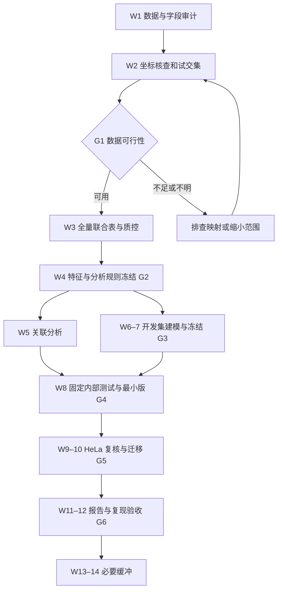

# ModStruct 完整执行路线图

> 依据：《ModStruct_本科生研究方案.md》。编制日期：2026-09-10。目标：把已有研究设计转化为可执行、可检查、可复现的研究任务。
>
> 当前在项目目录中仅发现研究方案、通俗解读和早期讨论整理，未发现数据文件或分析代码。以下是未来工作安排，不代表数据审计、环境检查或实验验证已经完成。本路线图沿用本地方案的数据候选与方法，不新增文献核验结论；数据真实状态以第 1—2 周审计为准。

## 文档信息（Material Passport）

- Origin Skill: academic-research-suite / experiment-agent
- Origin Mode: plan
- Origin Date: 2026-09-10
- Verification Status: UNVERIFIED（研究执行及数据内容尚未验证）
- Version Label: roadmap_v1
- 计划依据：同目录《ModStruct_本科生研究方案.md》，正式方案优先于通俗解读和早期讨论。
- 本文新增的文件名、任务拆分和管理规则均为实施建议，不是已存在的项目资产。

## 1. 完成目标与范围

**用公开 GLORI 和 icSHAPE 数据，建立可信的位点级联合表，回答 m6A 修饰比例与局部实验结构信号的关联，并通过固定测试集量化实验结构的额外预测价值。**

| 研究问题 | 实施目标 | 完成证据 |
|---|---|---|
| Q1：修饰比例与邻域反应性是否相关？ | HEK293T 描述、协变量调整、基因聚类不确定性估计 | 效应表、95% CI、局部曲线、敏感性分析 |
| Q2：实验结构能否提升预测？ | 同样本、同划分下比较序列、预测结构、实验结构 | 固定测试集 MAE、配对 ΔMAE 及区间 |
| Q3：换数据集后能否复核？ | HeLa 关联复核和冻结模型迁移 | 复核效应、全部合格位点与严格子集的表现 |
| Q4：能否区分修饰与低修饰背景？ | 仅在获得合格可测背景后考虑 | 背景检测能力、匹配记录、独立测试结果 |

主线限定人类 mRNA、m6A、HEK293T 发现集和 HeLa 复核集。Q4 和其他扩展不影响主线验收。结题不要求显著性、正向预测增益或发表；零增益和复核失败也应如实交付。

## 2. 周期、投入与关键路径

按方案采用 **12 周主线＋2 周缓冲**，学生每周约 12—15 小时，导师每周约 30 分钟。12 周对应约 144—180 小时学生投入，缓冲另计。以实际启动日作为第 1 周开始，不假定今天已启动数据分析。

关键路径如下；前一关未通过，后续统计结果不能成为正式证据：



HeLa 的文件可访问性和格式预查应在 W1—2 提前启动；正式关联和迁移分析放在主规则冻结之后。文献对比、数据字典、方法写作随各阶段同步维护。

## 3. 逐周任务与验收

| 周次 | 核心工作 | 必须交付 | 验收标准与依赖 |
|---|---|---|---|
| W1 | 阅读数据方法；记录来源；下载发现集处理后文件；检查环境；预查 HeLa | 文献对比表、来源清单、字段样例、环境记录 | 能说明每个输入的样本条件、数据单位和未知字段；未知项有处理任务 |
| W2 | 确认参考与注释版本；小规模映射；检查链向和窗口；试算交集 | 坐标审计、至少 20 个位点核查、初步筛选表、G1 决策 | 坐标与定量含义明确；交集数量为实际计算；据样本和基因数选择范围 |
| W3 | 全量解析和映射；重复整合；mRNA/异构体过滤；覆盖与缺失 QC | 联合表 v1、数据字典、完整筛选计数、重复 QC | 核心生物单位唯一；缺失未变零；所有排除可追溯 |
| W4 | 生成序列和实验结构特征；设计预测结构计算；建立分组；冻结配置 | 特征字典、划分表、配置 v1、图 1—2 初版、G2 记录 | 主终点、阈值、分组、搜索范围明确；测试集封存 |
| W5 | 主关联模型；基因聚类 bootstrap；必做敏感性分析 | 效应量表、模型诊断、图 3 | 报告效应、CI、位点和基因数；主分析与探索分析分开 |
| W6 | 201 nt 预测结构；开发集 M0—M4 Ridge；核对预处理 | 预测结构缓存、开发集比较表、训练流水线 | 所有拟合仅用训练折；模型比较使用共同位点集 |
| W7 | 数据量允许时运行轻量树模型；完成消融；固定模型 | 模型文件、参数、特征顺序、开发集结果、G3 记录 | 有限参数搜索完成；测试结果未用于选模；内部早停不跨组 |
| W8 | 一次性内部测试；配对 bootstrap；整理单细胞系交付 | 图 4、逐位点预测、最小版报告、可运行代码、G4 记录 | Q1＋Q2 最小版完整；若仅 M3 对 M1，明确证据范围 |
| W9 | HeLa 全量解析、同规则 QC、独立关联估计 | HeLa 联合表、流程表、复核效应表 | 未把 D/N 当重复；条件差异有记录；未按结果修改规则 |
| W10 | 冻结模型直接迁移；严格子集评估；有余力再选一个扩展 | 图 5、迁移结果、失败原因分析、G5 记录 | HeLa 标签不调参；严格子集不足时降低泛化表述 |
| W11 | 整合结果、方法、文献差异、失败案例和局限 | 报告初稿、5 张主图及图注、补充表、答辩提纲 | 每个结论可追溯至表或图；不遗漏零增益或不稳定结果 |
| W12 | 从固定中间表重跑关键分析；核查代码、数值和来源 | 最终交付包、复现记录、导师核查记录、G6 记录 | 独立运行说明有效；主要数值可重现；所有未完成项显式标注 |
| W13—14 | 吸收下载、注释映射、软件环境或报告修订延误 | 缺口关闭记录或明确的降级交付 | 不用缓冲期无限加模型或追求显著性 |

## 4. 阶段 A：数据审计与可行性（W1—2）

### 4.1 输入清单

以下均为原方案指定的候选，实际文件内容须审计后确认。

| 用途 | 候选输入 | 必须落实的问题 |
|---|---|---|
| HEK293T 实验结构 | GSE74353 的 InVivo BaseReactivities | 转录本版本、坐标起点、缺失编码、反应性定义 |
| HEK293T m6A | GSE210563：GSM6432590、GSM6432591 | 修饰比例字段、作者过滤规则、覆盖字段、重复对应 |
| HeLa 实验结构 | GSE145805 的处理后反应性 | 所需文件、结构处理流程、D/N 含义；不得作为生物重复合并 |
| HeLa m6A | GSM6432595、GSM6432596，hypoxia- 对照 | 常氧对照条件与另一研究的差异、字段一致性 |
| 参考与注释 | 原始结构研究对应的序列和转录本注释；GLORI 对应参考 | 版本来源、链方向、剪接结构和跨版本转换可行性 |

处理后原始文件保留只读副本。来源清单逐文件记录 accession、文件名、来源 URL、下载时间、SHA-256、样本条件、技术、参考版本和字段说明依据。未知项写“待确认”，不靠文件名推断。

### 4.2 坐标核查顺序

1. 确认每一行的生物含义、坐标起算方式和区间开闭。
2. 按结构数据实际转录本注释，将转录本位置映射到带链的基因组坐标。
3. 与 GLORI 位点连接，必要时进行有记录的参考版本迁移。
4. 验证转录本方向中央为 A，检查邻域序列；负链基因组参考可为 T。
5. 按剪接后的转录本提取 201 nt 序列，避免跨内含子直接截取基因组窗口。
6. 人工核查至少 20 个位点，覆盖正负链、剪接边界和多异构体情况；保存输入行、映射路径、期望值、程序值和结论。
7. 将中央碱基、长度、链向、边界和映射唯一性做成自动断言，异常进入排除表。

### 4.3 G1：继续、缩小或暂停

| 审计结果 | 决策 |
|---|---|
| 约 ≥2,000 位点且约 ≥300 基因，质量和分布合理 | 推进完整主线 |
| 约 500—2,000 位点，或独立基因较少 | 优先低维关联和 Ridge；减少特征，树模型降为选做 |
| 少于约 500 位点，或关键分层缺少独立基因 | 先排查版本、链向、窗口与覆盖；必要时评估原方案候选替代数据 |
| 坐标或修饰定量字段无法确定 | 暂停该数据正式统计；记录阻塞证据和待解决问题 |
| 缺乏有检测能力的低修饰背景 | 取消 Q4，继续连续比例主线 |

这些是原方案的工程门槛，不是统计功效保证。替代数据需重新走同一审计流程，不能因为某组合效果更好而替换主集。

## 5. 阶段 B：联合表、特征与分析冻结（W3—4）

### 5.1 联合表

以“基因组位点＋链＋细胞条件”为核心单位。保留原始重复测量和来源映射；用于正式分析的汇总表不得把同一位点的多个异构体当独立样本。主线保留局部序列和区域归属无歧义的记录。

联合表至少包含：位点/基因/转录本标识、参考与条件、重复比例及汇总比例、可获得的有效计数和置信指标、201 nt 序列、motif、区域、GC、终止密码子与剪接边界距离、实验反应性及缺失掩码、窗口覆盖、预测结构、纳入原因及 split_id。无法获得的表达或深度保留缺失说明，不伪造替代字段。

筛选表同时报告每一步的位点数和基因数：原始记录 → 去重 → 序列核查 → mRNA 注释 → 异构体处理 → 重复 QC → 结构覆盖 → 最终分析集。记录数、唯一位点数和基因数分别统计；顺序排除给出互斥主原因，另存全部失败标记。

### 5.2 冻结特征与 QC

- 响应：通过质量要求的重复整合 m6A 比例。只有比例时采用重复均值；有可比有效计数时按原流程评估能否合并计数。
- 主结构指标：R_flank10，即 -10…-1 和 +1…+10 的有效反应性均值；左右各至少 70% 有效值。
- 附加结构：R_up20、R_down20、R_far；R_0 仅附加分析。附加窗口的最低覆盖要求也应在审计后写入配置。
- 序列：固定 201 nt 的 one-hot 与预设 3-mer；边界导致窗口不足时，按预先确定规则排除或单列，不临时补齐。
- 预测结构：同一 201 nt 的未配对概率、MFE/nt、配对状态熵；保存软件版本、参数、温度和序列哈希。概率来自配分函数计算。
- 深度：仅在有效深度字段明确时比较 ≥10、≥20、≥50 的保留率，再确定主阈值；不根据正式关联结果选阈值。
- 缺失：按原文件定义转换，NULL 或 -999 不变成零；区分实测与 AI 填补信号。

### 5.3 G2：统计规则和数据划分同时冻结

HEK293T 约 80% 基因进入开发集、20% 进入内部测试集；开发集用 5 折 GroupKFold，基因不足时预先改为 3 折。同位点重复、同基因位点保持同组。跨基因完全重复的 201 nt 序列须同组或按固定规则去重；如连接多个基因，按基因与重复序列关系形成联合分组。审计高相似序列并说明未消除的同源性风险。

配置冻结至少包括：样本与参考版本、纳入规则、缺失编码、窗口、阈值、响应、协变量、主要指标、bootstrap 次数、随机种子、分组方法、参数候选、主模型比较、探索检验族和代表位点选择规则。

为保护测试集，开发阶段用于决定分组阈值、特征、变换的描述图和关联探索仅使用开发集。全发现集的纯测量 QC 可用于审计，但不能据测试标签关系挑特征。最终 Q1 可按冻结方案在完整发现集合格位点上估计；需明确分析人群，并避免将最终关联结果反馈到预测模型。W8 汇总时输出正式图表。

冻结后的错误仍应修正：记录原因、影响数据、配置版本和重跑范围。如果修正是在看到测试结果后发生，报告原结果及修正过程，不能把反复查看的测试集继续描述为完全未触及的验证集。

## 6. 阶段 C：关联分析（W5）

主模型使用连续修饰比例作为响应，R_flank10 为唯一主要结构指标，调整 DRACH 子型、转录本区域、局部 GC、距终止密码子距离及可获得的表达/覆盖信息。明确常规 DRACH 限定及其适用人群。

主表报告原始尺度系数、结构信号变化一个标准差对应的修饰比例变化、95% CI、位点数和基因数。基因聚类 bootstrap 建议 1,000 次，与聚类稳健标准误对照；检查残差及明显非线性。非线性敏感性方法和自由度提前固定。

必须完成以下敏感性分析：

| 分析 | 要排查的问题 |
|---|---|
| 排除中心 0 与进一步排除 -2…+2 | 关联是否高度依赖修饰邻位探测信号 |
| 更高结构覆盖子集 | 缺失和测量质量是否驱动关联 |
| GLORI 两个重复分别计算 | 关联是否依赖某一次测量 |
| 每基因等权 | 少数多位点基因是否主导 |
| 严格无异构体歧义集 | 映射和区域归属是否影响结论 |
| 样本允许时 CDS/3′UTR 分层 | 不同区域是否呈现不同效应 |

若主集已完全无异构体歧义，应说明这项限制已经落实，并报告更严格可辨识子集是否还能定义；不要重复同一分析冒充额外稳健性证据。

探索窗口、区域和逐位置检验分别定义检验族并做 BH-FDR。局部曲线逐位置报告有效数量；逐点 CI 不写成整条曲线的同时置信带。

## 7. 阶段 D：模型消融与最小版本（W6—8）

### 7.1 模型矩阵

记 C 为共同背景协变量，X 为 201 nt 序列，P 为同窗口计算结构，R 为实验结构。

| 编号 | 输入 | 解释 |
|---|---|---|
| M0 | C | 背景基线 |
| M1 | C＋X | 序列基线 |
| M2 | C＋X＋P | 计算结构表征的增益 |
| M3 | C＋X＋R | 实验结构相对序列的增益 |
| M4 | C＋X＋P＋R | 实验结构相对序列及计算结构的增益 |

先完成 Ridge；按方案少量比较 alpha=0.1、1、10、100。数据量允许时补 HistGradientBoostingRegressor，候选约 6—8 组；禁用随机内部早停，或使用明确不跨组的验证方式。每个学习器内部都使用相同样本、划分、响应和评价方法。

所有插补、缩放、特征选择和参数选择在训练折拟合。模型如需预测裁剪到 [0,1]，必须事先固定并对同类比较统一使用，不能在测试后择优。协变量或覆盖能产生预测增益不等于生物结构机制。

### 7.2 G3：测试前冻结

保存模型、预处理、特征顺序、训练数据哈希、参数、随机种子和开发集结果。建议将 Ridge 的 M4 对 M2 预设为主要模型族比较，树模型作补充；若采用其他主模型选择规则，必须在 G2 写明且仅依开发集执行，不能按内部测试结果选择主要结论。

### 7.3 W8 一次性测试

主要指标：ΔMAE = MAE(M2) − MAE(M4)，正值为误差降低；次要指标为 Spearman、RMSE 和 R²。MAE 若从 0—1 比例乘 100，单位为百分点，不能写成分类准确率。

使用测试基因或实际联合分组作为重抽样单位，对所有模型抽取同一批组，计算配对 ΔMAE 区间。若跨基因序列关系形成更大的组，以该独立分组为准。区间反映固定模型的测试样本不确定性，不覆盖全部批次与训练不确定性。

### 7.4 G4：最小版交付

- 可信 HEK293T 联合数据、完整筛选表和坐标核查。
- Q1 主关联、区间、必要敏感性分析与限制说明。
- 固定测试集序列与实验结构比较、逐位点预测和分组审计。
- 图 1—4、单细胞系报告、可运行脚本及配置。
- 若预测结构未完成，可用 M3 对 M1 交付最小版，但明确 M4 对 M2 尚未完成；该版本不能声称已分离计算结构和实验结构的贡献。

## 8. 阶段 E：HeLa 复核与可选扩展（W9—10）

HeLa 使用同一逻辑重新审计和建表，记录不同年份、处理流程及培养条件。发现阶段阈值和规则直接应用，失败时记录原因；必须调整的技术处理作为版本化偏离说明，不根据效应方向调规则。

**关联复核：** 在 HeLa 重新估计冻结定义的关联系数，报告方向、幅度、区间、位点数和基因数。这里重新拟合关联模型是独立复核，不等于允许用 HeLa 调整 HEK293T 预测模型。

**预测迁移：** 冻结 HEK293T 模型和预处理直接预测 HeLa，分别报告全部合格位点以及去除开发阶段已出现基因/重复序列后的严格子集。记录最终模型实际使用过的全部训练和调参数据，并以这些记录确定排除范围。W8 后不默认纳入内部测试集重新训练迁移模型。

| G5 结果 | 交付方式 |
|---|---|
| 合格数据充分 | 完成关联、迁移和严格子集比较，形成图 5 |
| 严格子集很少 | 报告数量与宽区间，限称跨细胞背景迁移 |
| 效应相反或模型迁移失败 | 报告失败，检查覆盖、范围与批次差异，不单归因于细胞特异性 |
| 数据始终不可用或定量不能确认 | 交付最小版＋受阻证据；明确未达到原方案 HeLa 完整版要求 |

只在主线完成后选一个扩展：401 nt 窗口敏感性（同步扩展序列基线）、in vitro 比较、SAC-seq 跨技术复核，或有合格背景时的分类/对数损失增益。高维条件互信息估计不进入本科主线。

## 9. 工程组织与可复现交付

以下为待实施的目录结构；本文仅制定路线图，不创建分析代码或数据。

```text
RNAmodStruct/
  README.md                         # 运行顺序、输入要求、预期输出
  config/analysis.yaml              # 冻结分析配置
  metadata/source_manifest.csv      # 来源、条件、哈希
  metadata/data_dictionary.md        # 原始字段与标准字段对应
  metadata/decision_log.md           # 决策、冻结及偏离记录
  metadata/coordinate/04_hek293t_coordinate_checks.csv    # 人工核查与自动断言摘要
  metadata/environment.txt          # Python、软件和包版本
  data/raw_processed/               # 原始处理后下载文件
  data/reference/                   # 可追溯参考与转录本注释
  data/interim/                     # 标准化、映射及折叠缓存
  data/final/                       # HEK293T/HeLa 联合表
  splits/gene_splits.csv            # 位点、基因、联合组、折号
  src/03_audit_inputs.py
  src/04_validate_coordinate_mapping.py
  src/03_build_features.py
  src/04_association.py
  src/05_models.py
  src/06_validate.py
  tests/                           # 坐标、特征公式、分组和泄漏检查
  results/tables/
  results/figures/
  results/models/
  results/predictions/
  results/logs/
  report/
```

使用已知 Python 路径 `E:\ancd\envs\my_pytorch\python.exe`，先检查实际包版本与可用性；路线图不假定已安装所需包。不修改现有 PyTorch 核心依赖。ViennaRNA 如需额外环境，独立处理；环境准备超过半天先推进序列和实验结构主线。

按方案暂以 16 GB 内存和 10—20 GB 项目空间做预算，W1 实测机器和输入规模后修订。主线无需 GPU。现有 LibreOffice 可供后续文档导出使用，正式格式按交付要求决定。

每个脚本需记录输入/配置哈希、版本、开始结束时间、记录数、输出路径和错误摘要。先做小批量试运行估计耗时、内存和磁盘，再确定全量任务超时；长任务按阶段或批次落盘。运行失败保留日志，定位原因后再重跑，禁止静默忽略坏行。

必要测试集中在高风险逻辑：正负链/外显子边界映射、窗口长度与中央 A、缺失掩码、反应性均值、概率/熵公式、重复整合、分组互斥、预处理仅训练折拟合，以及模型间样本一致性。

## 10. 结果包与验收关卡

| 成果 | 内容 | 验收点 |
|---|---|---|
| 图 1 | 数据来源、条件、筛选流程和数量 | 与来源和筛选表一致 |
| 图 2 | 重复一致性、覆盖、修饰分组局部曲线 | 分组规则冻结，逐位置有效数量可查 |
| 图 3 | 调整后效应与敏感性森林图 | 效应方向、单位、CI 与结果表一致 |
| 图 4 | M0—M4 MAE 与配对 ΔMAE | 同一测试样本；主比较事先明确 |
| 图 5 | HeLa 复核、迁移、代表位点 | 严格子集单列；展示至少一个失败案例 |
| 报告 | 问题、数据、方法、结果、讨论、限制、来源 | 每个结果可追溯；关联不写成因果 |
| 复现包 | 配置、划分、字典、代码、环境、运行说明 | 从固定中间表重跑主要表图成功 |

G6 最终核查：确定性数据转换和划分应一致；随机分析在固定种子与记录环境下复现，若存在数值差异，按事先规定的数值精度解释并记录，不能因为结论方向一致就视为完全复现。另保留从原始处理后文件重建中间表的步骤和必要参考文件。

报告必须明确：研究对象是已检出且通过 QC 的位点；icSHAPE 反应性不是直接配对概率；计算结构改善属于表征增益；调整仅覆盖列出的协变量；细胞系变化与研究批次纠缠；同基因和同源序列依赖的处理有实际边界。

## 11. 风险与应对优先级

| 风险信号 | 优先处理 | 对范围/进度的影响 |
|---|---|---|
| 中央非 A、motif 异常、交集极低 | 逐项查起点、链向、参考与转录本版本 | 阻断正式分析，优先使用缓冲 |
| 有效位点或独立基因少 | 排查后按 G1 缩小特征和模型规模 | 保留可支持的描述与低维分析 |
| 缺少深度或表达 | 继承有依据的作者过滤，标注不可调整项 | 不声称充分控制检测能力或表达 |
| 结构缺失偏向高表达 | 比较纳入/排除群体与高覆盖敏感性 | 收窄适用人群，不把插补当解决偏倚 |
| 折叠环境或计算延迟 | 先完成 M1/M3，缓存去重序列折叠 | 保住 W8 最小版；完整版补 M2/M4 |
| 测试集泄漏或测试后调规则 | 停止该版本结论，审计影响并说明 | 不用新随机种子掩盖既有泄漏 |
| ΔMAE≤0、区间宽或方向不稳定 | 核查流程后如实报告 | 不以扩大搜索或更换阈值追求正值 |
| HeLa 不可用 | W1—2 提前预查，评估原方案备选 | 完整版延期或明确降级，不冒称完成 Q3 |
| 工作量超预算 | 按 Q4/扩展 → 树模型 → 可选图解释依次删减 | 保护坐标核查、主关联、固定测试与复现 |

## 12. 责任分工与每周执行方式

学生负责实际数据读取、脚本执行、来源与决策记录，并能解释每列和每张图；导师重点核对 G1 数据含义、G2 研究规则、G3 测试前冻结和 G6 结论边界。AI 可辅助写代码、检索和整理，不代替实际文件验证或导师判断，按学校要求披露使用情况。

每周固定形成一页进展记录：已完成任务及证据路径、实际位点/基因数变化、未解决问题、配置偏离、下一周最多三个优先任务。未知数据语义和关键规则争议应及时提交讨论；无争议工程工作持续推进，不等周会才处理。

## 13. 启动后的前五个工作块

1. **准备（约 2 小时）：** 建立目录、来源清单和决策记录；检查 Python、可用内存与磁盘；列出缺少的软件，暂不改动核心环境。
2. **数据定位与字段审计（约 3 小时）：** 获取发现集处理后文件并记录哈希；逐列解释表头、缺失与单位；预查 HeLa 处理后反应性是否可取。
3. **参考追溯（约 3 小时）：** 确认结构数据的转录本序列和注释版本、GLORI 参考及链信息，列出不能直接连接的原因。
4. **映射试验（约 3—4 小时）：** 选正负链和边界案例，建立可检查的小规模映射；未解决的版本问题优先带入 W2。
5. **阶段复盘（约 1—2 小时）：** 输出字段字典草稿、风险表和 W2 待办；已有可靠试交集时报告实数，没有时保持待计算。

首阶段的完成标志是能够用可追溯证据说明“两个文件中的这个记录确实对应同一个 RNA 位点”。之后再进入全量联合、统计和建模。
